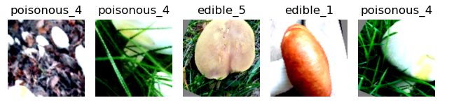
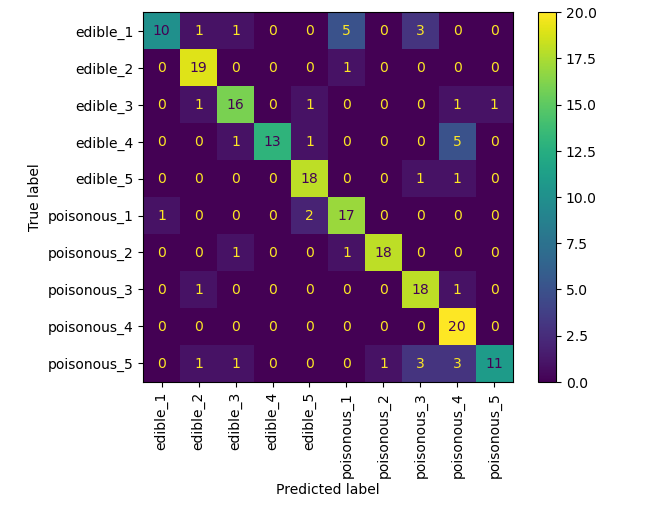
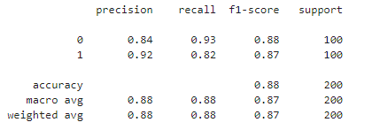

# 🍄 Automated Fungi Classification Project

Welcome to the Automated Fungi Classification project, developed for the Brisbane Flora and Fauna Society (BFFS). This project leverages machine learning (ML) and computer vision to classify fungi species from photographs, distinguishing between edible and poisonous types. This system aims to help prevent poisoning incidents while promoting safe foraging and ecological awareness.

## 🌟 Project Overview

With the increasing number of fungi species appearing in Brisbane due to tropical weather, distinguishing between edible and poisonous fungi has become critical. This project provides a feasibility study using a **DINOv2 Vision Transformer** model combined with a **linear classifier**, aiming for high accuracy in fungi identification with limited computational resources.

## 🔍 Key Features

- **Transfer Learning Approach:** Uses a pre-trained DINOv2 Vision Transformer for feature extraction.
- **Custom Linear Classifier:** A lightweight, fast model optimized for edge devices.
- **Robust Data Augmentation:** Techniques such as random flips, rotations, and Gaussian blur improve generalization.
- **Efficient Execution:** Fast inference suitable for mobile applications (average inference time: 46.86 milliseconds).

## 🚀 Getting Started

### Prerequisites

Ensure you have the following installed:

- Python 3.10+
- `torch`, `torchvision`, `PIL` (Install using `pip install torch torchvision Pillow`)
- Pre-trained DINOv2 model and saved weights file (`ModifiedLinear_Dino_LR0.003.pth`)

### Project Structure

```bash
.
├── Project1.py                # Main classifier code
├── Dino_Performance.ipynb     # Training and performance evaluation
├── Means_Stds.ipynb           # Data preprocessing and analysis
└── ModifiedLinear_Dino_LR0.003.pth     #Saved model parameters
```

### Installation

Clone the repository and navigate to the project directory:

```bash
git clone https://github.com/yourusername/fungi-classification.git
cd fungi-classification
```

### Usage

To use the classifier, initialize it and test with a sample image:

```python
from Project1 import MyClassifier
from PIL import Image

# Initialize the classifier
classifier = MyClassifier()
classifier.setup()

# Load an image and test
image = Image.open('path/to/sample_image.jpg')
prediction = classifier.test_image(image)
print(f"Predicted class: {prediction}")
```

## 🧠 Model Architecture

The classifier uses a **two-stage approach**:

1. **Feature Extraction**:
   - The DINOv2 Vision Transformer (`dinov2_vits14`) extracts 384-dimensional feature embeddings from input images.
2. **Linear Classification**:
   - A custom linear layer maps these embeddings to 10 possible class labels (5 edible, 5 poisonous).

### Data Augmentation

The following techniques were applied to increase model robustness:

- Random horizontal flips
- Rotations up to 30 degrees
- Gaussian blur
- Random resized crops

**Figure 1: Data Augmentation Pipeline**

> 

## 📊 Performance

The model achieved a **validation accuracy of 84%**, with the following key performance metrics:

- **Poisonous Fungi (Class 0)**:
  - Precision: 0.84
  - Recall: 0.93
- **Edible Fungi (Class 1)**:
  - Precision: 0.92
  - Recall: 0.82
- **F1-Score**:
  - Poisonous: 0.88
  - Edible: 0.87

**Figure 2: Confusion Matrix**

> 

### Inference Speed

- **Setup time**: 0.315 seconds
- **Average inference time per image**: 46.86 milliseconds

## 📈 Evaluation

The confusion matrix highlights strong performance, but there are some consistent misclassifications, likely due to visual similarities between certain fungi species.

**Figure 3: Performance Metrics**

> 

## 🔧 Challenges and Recommendations

### Challenges

- **Limited Dataset**: Only 1000 images were available for training, which may not capture the full variability of fungi species.
- **Image Quality**: Real-world images may have poor lighting or resolution, affecting model accuracy.

### Recommendations

- **Data Expansion**: Increase the dataset size (500-1000 images per species) for better generalization.
- **Model Enhancement**: Experiment with advanced architectures (e.g., EfficientNet).
- **Safety Measures**: Integrate expert verification for uncertain cases and educate users on the limitations.

## 📜 License

This project is licensed under the MIT License - see the [LICENSE](LICENSE) file for details.

## 🤝 Acknowledgements

Special thanks to the Brisbane Flora and Fauna Society for their collaboration and support. The dataset is credited to Picek, Lukáš et al., from the "Danish fungi 2020" image recognition dataset.

---

Feel free to replace placeholder images and paths with the actual visuals and file locations. If you need any additional sections or modifications, let me know!